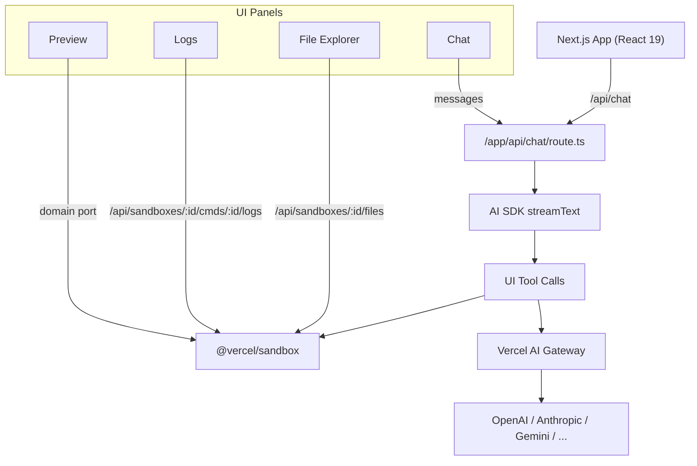

# Vercel Vibe Coding Agent

An end-to-end, AI-powered coding environment that turns natural-language prompts into runnable apps inside an isolated Vercel Sandbox. It streams tool progress to the UI, shows logs, previews running servers, and lets you inspect generated files in real time.

Built with Next.js 15, React 19, Tailwind CSS, and the AI SDK v5. It integrates with Vercel AI Gateway for multi-model support (OpenAI GPT‑5, O4-mini, Anthropic Claude, Gemini, Nova, Grok, etc.).

---

## Quick start

```bash
# 1) Install deps (Bun recommended)
bun install

# 2) Set env var for Vercel AI Gateway
#   (Use your Gateway endpoint URL)
#   Windows (PowerShell):  $env:AI_GATEWAY_BASE_URL="https://gateway.vercel.ai/api/v1"
#   macOS/Linux (bash):    export AI_GATEWAY_BASE_URL="https://gateway.vercel.ai/api/v1"

# 3) Dev server
bun run dev
# Open http://localhost:3000
```

- Lint: `bun run lint`
- Build: `bun run build`
- Start: `bun run start`

Note: This repo currently has no test script configured.

---

## What this project does

- Lets you chat with an agent that can:
  - Create a fresh Vercel Sandbox (ephemeral Linux container)
  - Generate and upload complete files into the Sandbox
  - Run commands (install, build, start) and wait for completion
  - Expose ports and fetch a public preview URL
- Streams every tool action back to the UI as it happens
- Shows a live file explorer and tailing command logs
- Provides an in-app browser preview of the running app

---

## Architecture overview



Key flows
- /api/chat streams model output and tool events to the browser
- Tool calls orchestrate Sandbox lifecycle: create → generate files → run → wait → preview
- Zustand stores sandbox state (id, status, paths, commands, url) client‑side

---

## Directory map (what lives where)

```
.
├─ ai/
│  ├─ constants.ts          # Default model, supported models, sample prompts
│  ├─ gateway.ts            # Vercel AI Gateway provider + model options
│  ├─ messages/
│  │  ├─ data-parts.ts      # Zod schema for tool data payloads
│  │  └─ metadata.ts        # Zod schema for message metadata
│  └─ tools/                # Tool implementations (used by the agent)
│     ├─ create-sandbox.ts  # Creates a sandbox
│     ├─ generate-files.ts  # Streams file generation and uploads to sandbox
│     ├─ get-sandbox-url.ts # Returns public URL for an exposed port
│     ├─ run-command.ts     # Starts a command (detached)
│     ├─ wait-command.ts    # Waits for a command to finish
│     └─ index.ts           # Registers tools for streamText
│
├─ app/
│  ├─ api/
│  │  ├─ chat/
│  │  │  ├─ prompt.md       # System prompt for the coding agent
│  │  │  └─ route.ts        # Streams chat + tool calls
│  │  ├─ models/route.tsx   # Filters available models via Gateway
│  │  └─ sandboxes/[...]/   # Sandbox helper endpoints (status, files, logs)
│  ├─ chat.tsx              # Chat panel wiring (useChat, ModelSelector)
│  ├─ file-explorer.tsx     # Connects store → File Explorer component
│  ├─ preview.tsx           # Connects store → Preview component
│  ├─ logs.tsx              # Logs panel container
│  ├─ actions.ts            # Server actions (e.g., dismiss welcome)
│  ├─ state.ts              # Zustand stores + data mapper for tool events
│  ├─ layout.tsx            # Root layout, toasts, SandboxState watcher
│  └─ page.tsx              # Tabs layout (Chat, Preview, Files, Logs)
│
├─ components/
│  ├─ chat/                 # Message rendering and tool-part UIs
│  │  ├─ message.tsx
│  │  ├─ message-part/
│  │  │  ├─ create-sandbox.tsx
│  │  │  ├─ generate-files.tsx
│  │  │  ├─ get-sandbox-url.tsx
│  │  │  ├─ run-command.tsx
│  │  │  ├─ wait-command.tsx
│  │  │  └─ text.tsx, reasoning.tsx
│  │  └─ tool-message.tsx, tool-header.tsx, message-spinner.tsx
│  ├─ file-explorer/        # Sandbox filesystem browser
│  ├─ preview/              # In-app browser (iframe) with refresh
│  ├─ modals/               # Welcome + Sandbox status dialog
│  ├─ panels/               # Panel scaffolding
│  └─ ui/                   # Shadcn-style primitives
│
├─ next.config.ts           # MD loader, images, botid wrapper
├─ package.json             # Scripts and dependencies
├─ tsconfig.json            # TS config (paths, JSX, bundler resolution)
└─ public/                  # Static assets
```

---

## End-to-end chat flow

1) User submits a message from `app/chat.tsx` via `useChat`
2) Request hits `app/api/chat/route.ts`
   - Validates bots with `checkBotId`
   - Fetches models from Gateway and selects model options
   - Calls `streamText` with:
     - `system`: `app/api/chat/prompt.md`
     - `tools`: from `ai/tools/index.ts`
     - `stopWhen`: `stepCountIs(20)`
3) As the model streams tokens and triggers tool calls, the server converts them to UI message parts and streams them back
4) Client maps each incoming part to local state via `useDataStateMapper` in `app/state.ts`:
   - New sandbox id → store it
   - Uploaded file paths → update file explorer
   - New command id → append to logs list
   - New preview url → update preview

---

## The toolbelt (what the agent can actually do)

All tools live in `ai/tools/` and are registered in `ai/tools/index.ts`.

- createSandbox
  - Input: `{ timeout?: number, ports?: number[] }`
  - Output stream: `data-create-sandbox`
  - Creates a Vercel Sandbox and streams a `sandboxId`

- generateFiles
  - Input: `{ sandboxId: string }`
  - Implementation detail: nested `streamObject` call with a schema:
    ```ts
    { files: Array<{ path: string, content: string }> }
    ```
  - Streams progress: `generating` → `uploading` → `uploaded` → `done`
  - Uses `Sandbox.writeFiles` to upload files incrementally

- runCommand
  - Input: `{ sandboxId: string, command: string, args?: string[], sudo?: boolean }`
  - Starts a detached command in the Sandbox and streams `{ commandId }`
  - Important: each command runs in a fresh shell session → use absolute or relative paths; do not rely on `cd`

- waitCommand
  - Input: `{ sandboxId, commandId, command, args }`
  - Waits until completion and returns `exitCode`, `stdout`, `stderr`

- getSandboxURL
  - Input: `{ sandboxId: string, port: number }`
  - Returns a public URL for a port that must have been exposed when the sandbox was created

UI components under `components/chat/message-part/*` provide rich, per-tool inline status rendering (spinners, checkmarks, links, etc.).

---

## Models and Gateway

- Models displayed in the UI come from `GET /api/models`, which calls Gateway and filters by `SUPPORTED_MODELS` in `ai/constants.ts`.
- Default model: `DEFAULT_MODEL` (`openai/gpt-5`).
- Per-model behaviors (e.g., OpenAI reasoning options, Anthropic headers) are configured in `ai/gateway.ts#getModelOptions`.
- To add or remove a model from the dropdown, edit `SUPPORTED_MODELS`.

Environment
- Required: `AI_GATEWAY_BASE_URL` → base URL for Vercel AI Gateway
- Set locally in your shell (do not commit .env). Vercel: add it to Project Settings → Environment Variables.

---

## UI, state, and panels

- State: `app/state.ts` defines a Zustand store for Sandbox session and a data mapper that reacts to streamed tool parts
- Panels: `components/panels` frame each area (Chat, Files, Logs, Preview)
- File Explorer: `components/file-explorer` builds a navigable tree from uploaded paths and fetches file content from `/api/sandboxes/:id/files?path=...`
- Logs: `components/commands-logs` streams NDJSON logs from `/api/sandboxes/:sandboxId/cmds/:cmdId/logs`
- Preview: `components/preview/preview.tsx` renders an iframe with refresh, open-in-new, and retry helpers

---

## API surface

- `POST /api/chat` — primary streaming endpoint for chat + tools
- `GET  /api/models` — list of allowed models (via Gateway)
- `GET  /api/sandboxes/:sandboxId` — ping to detect stopped Sandbox
- `GET  /api/sandboxes/:sandboxId/files?path=...` — stream file content
- `GET  /api/sandboxes/:sandboxId/cmds/:cmdId` — command status
- `GET  /api/sandboxes/:sandboxId/cmds/:cmdId/logs` — NDJSON logs

---

## Customization guide (how to edit and extend)

- Change system prompt
  - Edit `app/api/chat/prompt.md` (supports Markdown)
- Add/remove models
  - `ai/constants.ts` → `SUPPORTED_MODELS`
  - Optionally tweak behavior in `ai/gateway.ts#getModelOptions`
- Add a new tool
  1) Create `ai/tools/my-tool.ts` using `tool({...})`
  2) Register it in `ai/tools/index.ts`
  3) Add a UI renderer in `components/chat/message-part/`
  4) Update `ai/messages/data-parts.ts` schema with your part shape
- Change the file explorer or logs UI
  - Edit `components/file-explorer/*` or `components/commands-logs/*`
- Adjust panels and layout
  - `app/page.tsx`, `components/panels/*`
- Theming/styles
  - Tailwind classes across components; global styles in `app/globals.css`

---

## Local development

- Install: `bun install`
- Run dev: `bun run dev` → `http://localhost:3000`
- Lint: `bun run lint`
- Build: `bun run build`
- Start: `bun run start`

If you change TypeScript config or aliases, restart the dev server.

---

## Deployment (Vercel)

- Set `AI_GATEWAY_BASE_URL` in Project → Settings → Environment Variables
- Enable Edge/Streaming as needed (default Next.js settings work)
- `next.config.ts` already configures MD loading and image remote patterns

---

## Conventions & notes

- Conventional Commits for messages (e.g., `feat:`, `fix:`, `chore:`)
- No secrets in code. Use environment variables only.
- Avoid reading `.env*` files in code. Pass required values via process env at runtime.
- Each sandbox command runs in a fresh shell — use full or relative paths. Do not rely on `cd` or shell state between commands.

---

## Troubleshooting

- Models list is empty
  - Ensure `AI_GATEWAY_BASE_URL` is set and reachable
  - Gateway project must have the models you expect enabled
- Preview is blank
  - Confirm you exposed the correct port when creating the sandbox
  - Verify the app inside the sandbox is listening on that port
- Commands appear stuck
  - Use `waitCommand` after `runCommand` for dependent steps
  - Check NDJSON logs at `/api/sandboxes/:id/cmds/:cmdId/logs`

---

## FAQ

- Why Vercel Sandbox?
  - It provides an isolated, ephemeral Linux environment for safe code execution with streaming APIs and robust file/command primitives.
- Why the AI Gateway?
  - One endpoint to many providers, consistent auth, observability, rate limiting, and advanced features like safety, caching, and fallbacks.
- Can I add my own UI around the agent?
  - Yes. The agent is just a streaming endpoint plus a toolbelt; you can build any front-end on top.

---

## License

MIT – see LICENSE (or add one if missing).
